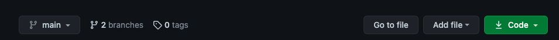

# _Epikrypto_

#### _Information page about different cryptocurrencies._

#### Team Members

* **Alejandra Goldberg-Dominguez**
* **DeAunt'e Hall**
* **Mary Marks**
* **Carlos Urquiza**

## Technologies Used

* _HTML_
* _CSS_
* _Bootstrap_
* _JavaScript_
* _jQuery_
* _Git_
* _GitHub Pages_
* _webpack_
* _CryptoCompare API_
* _YouTube iFrame_

## Description

_Information page about different cryptocurrencies, its history and the future of cryptocurrency in developing nations. This page provides the following information:_

* _Live up-to-date cryptocurrency pricing_
* _Relevant news articles_
* _Use of the [CryptoCompare API](https://min-api.cryptocompare.com/documentation)_
* _Informational video about cryptocurrency mining_

## Setup/Installation Requirements

* _Clone this repository. To clone using HTTPS, click on the green download button above the list of files and click on the clipboard icon to save the repository URL._

* _Open your terminal._
* _Navigate to the directory (such as your Desktop) where you want the cloned directory._
* _Type `git clone` and paste the URL you copied._
* _Press Enter._
* _Navigate to the project folder on your computer._
* _Recreate project environment by running `$ npm install`._
* _Visit the [CryptoCompare API](https://min-api.cryptocompare.com/documentation) site to get a free API key._
* _Click on `Get your free API Key`._
* _Click on `SIGNUP` button and enter your email address and password._  
* _Click the `Signup` button under the Password section._
* _Once your CryptoCompare API is activated, copy your API key._
* _Create a `.env` file in the top level of your project._
* _Store your API key as `API_KEY={API key goes here}` within your `.env` file._
* _Run `$ npm run build` to open project via a development server._
* _View project using development server by running `$ npm run start`._
* _Alternatively, you can view the live webpage via this [GitHub Page](). You will still require an API key to use._

## Known Bugs

* _Our current API implementation only returns a success message to the DOM, but current state doesn't populate any other results. The user will have to check their console for results._

## License

MIT License

Copyright (c) 2021
 
Alejandra Goldberg-Dominguez | DeAunt'e Hall | Mary Marks | Carlos Urquiza

Permission is hereby granted, free of charge, to any person obtaining a copy
of this software and associated documentation files (the "Software"), to deal
in the Software without restriction, including without limitation the rights
to use, copy, modify, merge, publish, distribute, sublicense, and/or sell
copies of the Software, and to permit persons to whom the Software is
furnished to do so, subject to the following conditions:

The above copyright notice and this permission notice shall be included in all
copies or substantial portions of the Software.

THE SOFTWARE IS PROVIDED "AS IS", WITHOUT WARRANTY OF ANY KIND, EXPRESS OR
IMPLIED, INCLUDING BUT NOT LIMITED TO THE WARRANTIES OF MERCHANTABILITY,
FITNESS FOR A PARTICULAR PURPOSE AND NONINFRINGEMENT. IN NO EVENT SHALL THE
AUTHORS OR COPYRIGHT HOLDERS BE LIABLE FOR ANY CLAIM, DAMAGES OR OTHER
LIABILITY, WHETHER IN AN ACTION OF CONTRACT, TORT OR OTHERWISE, ARISING FROM,
OUT OF OR IN CONNECTION WITH THE SOFTWARE OR THE USE OR OTHER DEALINGS IN THE
SOFTWARE.

## Contact Information

_Feel free to contact alexdominguezwebdev@gmail.com, godsofolympus88@gmail.com, maryleemarks@gmail.com or webquiza@gmail.com with any questions regarding this webpage._